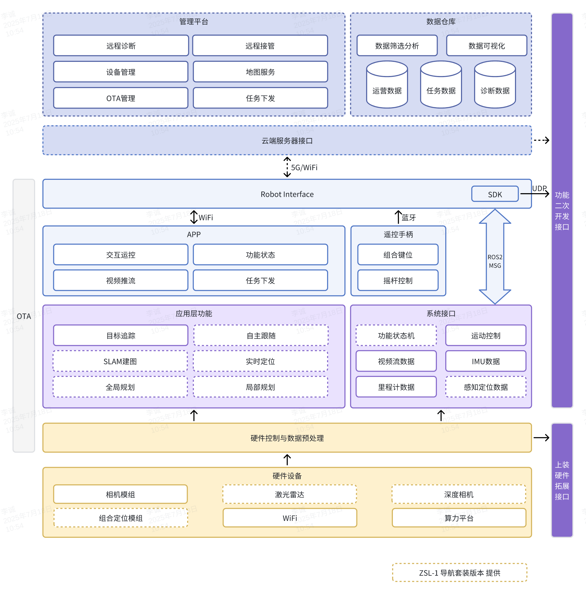
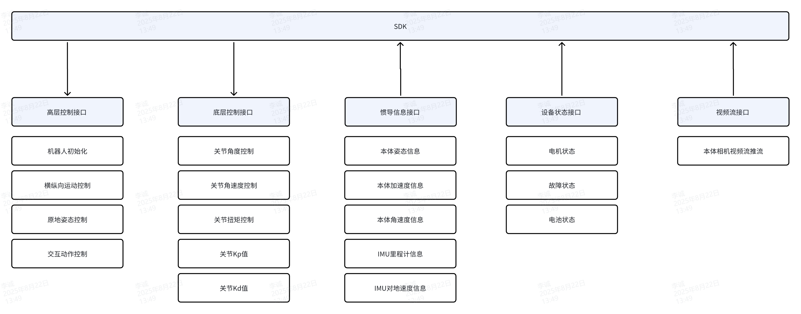

# 架构与目录结构

> 本节仅描述 **对外发布版** 的目录结构与模块关系，**不涉及 `/src` 内部实现**。

## 顶层目录结构（摘要）

```
├─ demo/
│  ├─ zsl-1/
│  │  ├─ cpp/
│  │  └─ python/
│  └─ zsl-1w/
│     ├─ cpp/
│     └─ python/
├─ include/
│  ├─ zsl-1/
│  │  ├─ highlevel.h
│  │  └─ lowlevel.h
│  ├─ zsl-1w/
│  │  └─ highlevel.h
│  ├─ zsm-1w/
│  │  └─ highlevel.h
│  ├─ lowlevel/
│  │  └─ lowlevel.h
├─ lib/
│  ├─ zsl-1/
│  │  ├─ aarch64/
│  │  └─ x86_64/
│  ├─ zsl-1w/
│  │  ├─ aarch64/
│  │  └─ x86_64/
│  └─ zsm-1w/
│     ├─ aarch64/
│     └─ x86_64/

```

关键目录说明：

- `include/`：头文件（公共头与机型专属头）
    - `include/zsl-1/highlevel.h`、`include/zsl-1/lowlevel.h`
    - `include/zsl-1w/highlevel.h`
    - `include/zsm-1w/highlevel.h`

- `lib/`：已编译的运行库（按机型与架构区分）
    - `lib/<model>/<arch>/libmc_sdk_<model>_<arch>.so`
    - `lib/<model>/<arch>/mc_sdk_<model>_py.*.so`（Python 扩展）

- `demo/`：示例程序（C++ / Python）
    - `demo/zsl-1/cpp`、`demo/zsl-1/python/examples`
    - `demo/zsl-1w/cpp`、`demo/zsl-1w/python/examples`
    - **注意**：当前仓库未提供 `zsm-1w` 的 demo，可参考 `zsl-1w` 示例迁移
- 其他：`CMakeLists.txt`、`build.sh`、`README.md` 等

## ZsiBot 系统架构




## SDK软件框图
> 当前已开放运动控制相关SDK接口, 包括高层运动控制接口、底层电机控制接口、IMU 惯导数据接口、电机状态数据接口



## SDK软件接口


## 运动控制状态机

指令下发需要按照以下状态跳转逻辑, 否则可能会造成机器摔倒/故障/不响应


## 关节控制命令说明

**📌 命令顺序**

- FR（右前）
- FL（左前）
- RR（右后）
- RL（左后）

### 🔄 关节方向定义

A,H,K关节坐标系 前X， 左Y， 上Z


### 🔧 控制参数

```c++
关节角度指令
float q_des_abad[4] // A 关节角度指令
float q_des_hip[4]  // H 关节角度指令
float q_des_knee[4] // K 关节角度指令

关节角速度指令
float qd_des_abad[4]  // A 关节角速度指令
float qd_des_hip[4]  // H 关节角速度指令
float qd_des_knee[4] // K 关节角速度指令

关节 PID 参数
float kp_abad[4]  // A 关节 Kp
float kp_hip[4]   // H 关节 Kp
float kp_knee[4] // K 关节 Kp

float kd_abad[4]  // A 关节 Kd
float kd_hip[4]   // H 关节 Kd
float kd_knee[4]  // K 关节 Kd

关节扭矩指令
float tau_abad_ff[4]  // A 关节扭矩指令
float tau_hip_ff[4]   // H 关节扭矩指令
float tau_knee_ff[4]  // K 关节扭矩指令
```
