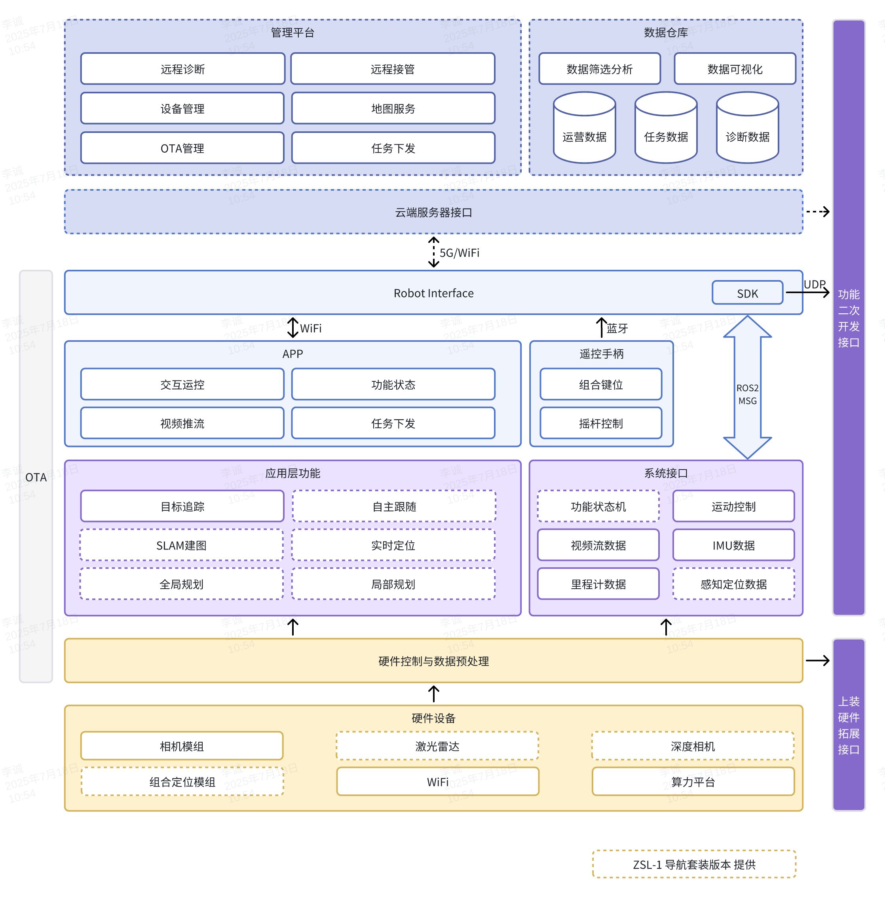
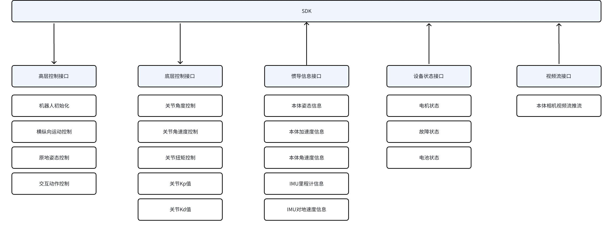
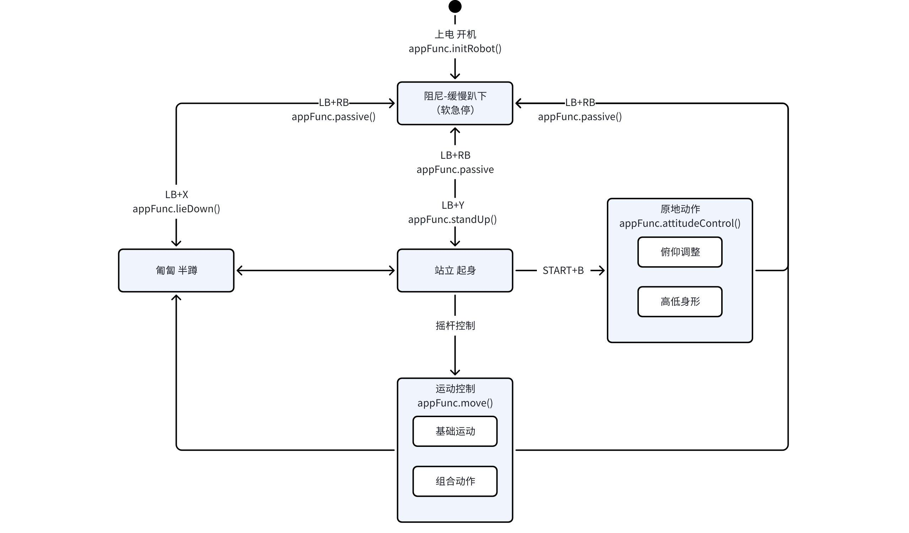
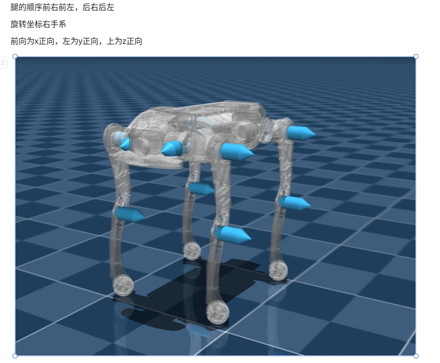

# **ZsiBot SDK 系统架构** 

## SDK目录结构
    

```Shell
├── demo
│   ├── zsl-1
│   │   ├── cpp                                                         # cpp示例
│   │   └── python                                                      # python示例
│   └── zsm-1w
├── include
│   ├── zsl-1
│   │   ├── highlevel.h                                                 # 高级控制头文件
│   │   └── lowlevel.h                                                  # 低级控制头文件                                        
│   └── zsm-1w
│       └── highlevel.h
└── lib
    ├── zsl-1
    │   ├── aarch64
    │   │   ├── libmc_sdk_zsl_1_aarch64.so                              # C++控制so包
    │   │   └── mc_sdk_zsl_1_py.cpython-310-aarch64-linux-gnu.so        # python控制so包
    │   └── x86_64
    │       ├── libmc_sdk_zsl_1_x86_64.so
    │       └── mc_sdk_zsl_1_py.cpython-310-x86_64-linux-gnu.so
    └── zsm-1w
        ├── aarch64
        │   ├── libmc_sdk_zsm_1w_aarch64.so
        │   └── mc_sdk_zsm_1w_py.cpython-310-aarch64-linux-gnu.so
        └── x86_64
            ├── libmc_sdk_zsm_1w_x86_64.so
            └── mc_sdk_zsm_1w_py.cpython-310-x86_64-linux-gnu.so

```

## ZsiBot 系统架构




## SDK软件框图
> 当前已开放运动控制相关SDK接口, 包括高层运动控制接口、底层电机控制接口、IMU 惯导数据接口、电机状态数据接口



## SDK软件接口


## 运动控制状态机

指令下发需要按照以下状态跳转逻辑, 否则可能会造成机器摔倒/故障/不响应



## 关节控制命令说明

**📌 命令顺序**

- FR（右前）
- FL（左前）
- RR（右后）
- RL（左后）

### 🔄 关节方向定义

A,H,K关节坐标系 前X， 左Y， 上Z


### 🔧 控制参数

```c++
关节角度指令
float q_des_abad[4] // A 关节角度指令
float q_des_hip[4]  // H 关节角度指令
float q_des_knee[4] // K 关节角度指令

关节角速度指令
float qd_des_abad[4]  // A 关节角速度指令
float qd_des_hip[4]  // H 关节角速度指令
float qd_des_knee[4] // K 关节角速度指令

关节 PID 参数
float kp_abad[4]  // A 关节 Kp
float kp_hip[4]   // H 关节 Kp
float kp_knee[4] // K 关节 Kp

float kd_abad[4]  // A 关节 Kd
float kd_hip[4]   // H 关节 Kd
float kd_knee[4]  // K 关节 Kd

关节扭矩指令
float tau_abad_ff[4]  // A 关节扭矩指令
float tau_hip_ff[4]   // H 关节扭矩指令
float tau_knee_ff[4]  // K 关节扭矩指令
```
