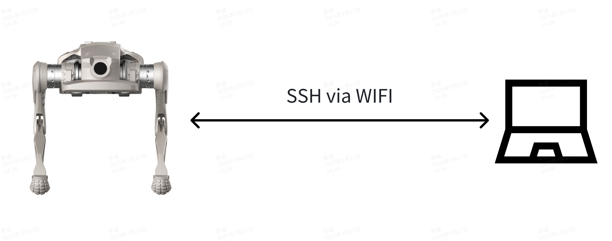

# How to Deploy

当前文档适用于SDK版本v0.2.6以上，运控版本v0.2.6以上（狗本体0.2.0以上）


**环境依赖**

- Ubuntu 22.04
- CMake 3.8+
- GCC 11+
- Eigen3
- boost
- python3


## 1. 网络通讯
设备上配备无线网络与有线网络接口，其中无线网络信息位于设备右侧标签，标签内标注有设备SSID与密码信息。



机器人默认ip:

| 网络接口 | IP地址 | DHCP |
| --- | --- | --- |
| 无线网络 | 192.168.234.1 | 有 |
| 有线网络 | 192.168.168.168 | 无 |


无线网络配备DHCP服务，连接上无线网络后，确保操作设备无线网络未配置固定IP，可以直接通过192.168.234.1与狗建立通讯。

有线网络不配备DHCP服务，通过有线连接后，需要再操作设备有线网络配置固定IP，且IP为168网段，即可与狗建立通讯。

机器人ip如有变更，需参照配置`export SDK_CLIENT_IP="机器人新ip"`

---

## 2. 修改设备内与SDK通讯相关参数
### 2.1 登录设备
设备提供ssh登录，通过WiFi或无线与设备创建连接后，可通过命令：
```bash
ssh firefly@{IP}    #密码：firefly
```
根据有线/无线修改对应的`{IP}`，密码与用户名同样为firefly。
### 2.2 查看设备版本
登录设备后，执行以下命令查看当前设备版本：
```bash
grep -oP 'motion-control_\K[^_]+' /etc/{jszr_,}release/*[^rootfs]*.yaml
```
将命令执行后的输出内容复制发送给对应技术支持人员(FAE)，FAE会提供对应版本的SDK程序。
### 2.3 修改SDK配置文件
通过vim命令修改`/opt/export/config/sdk_config.yaml`文件：
```yaml
target_ip: "127.0.0.1"
target_port: 43988
```
将`target_ip`修改为控制端设备连接狗之后的IP地址，`target_port`如无必要可不修改。
默认设备仅支持WiFi网络，即`target_ip`为`192.168.234.X`的IP地址，如需要通过网线或其他网段IP通讯，需配合步骤2.4配置`SDK_CLIENT_IP`
### 2.4 配置SDK_CLIENT_IP
如需要使用网线或其他非192.168.234.X网段IP控制设备，需要通过vim命令修改`/opt/app_launch/start_motion_control.sh`文件：

```bash

#!/bin/bash

echo "start motion control"

# 共享内存文件路径
SHM_FILE="/dev/shm/spline_shm"

# 循环检查设备是否存在
while true; do
    if [ -e "$SHM_FILE" ]; then
        echo "共享内存文件 $SHM_FILE 已存在。"
        break
    else
        echo "共享内存文件 $SHM_FILE 不存在，等待 1 秒后重试..."
        sleep 1
    fi
done

# 共享内存文件存在后执行的命令
echo "共享内存文件已准备好，可以执行后续操作。"

sudo ifconfig lo multicast
sudo route add -net 224.0.0.0 netmask 240.0.0.0 dev lo

export LD_LIBRARY_PATH=/opt/export/mc/bin
export ROBOT_TYPE=P2
# export SDK_CLIENT_IP="机器人新ip"

cd /opt/export/mc/bin && taskset -c 7 ./mc_ctrl r
``` 
在上面代码27行，增加对应配置:`export SDK_CLIENT_IP="机器人新ip"`，并将机器人的IP地址填写在对应参数内，如使用有线网络，则将机器人新IP修改为192.168.168.168,如果是其他IP则修改到对应IP即可。

⚠️ 2.3与2.4配置后，请重启设备，否则参数无法生效。

---

## 3. 修改SDKDemo配置
    
  **配置本地 IP 和端口**

  在代码中修改 CLIENT_IP 和 CLIENT_PORT：

  示例：
    
```C++
constexpr int CLIENT_PORT = 43988;      // 本地端口  
std::string CLIENT_IP = "192.168.234.15"; // 本地 IP 地址
// 机器人ip默认192.168.234.1，如果需要更改机器人IP可通过init_robot()接口传入更改后的机器人ip
```
    
      
    
**配置机器人端 IP 和端口**
`当前步骤与2.3一致,若已在2.3中配置过，则无需重复配置`
```Shell
ssh firefly@192.168.234.1 # 密码 firefly
```
    
编辑配置文件： 📌 路径： `/opt/export/config/sdk_config.yaml`

配置示例
    
```YAML
target_ip: "192.168.234.15"
target_port: 43988
```
    
⚠️ 请确保机器人 IP 和端口号匹配，否则无法建立通信。

⚠️ 如果删除或注释掉sdk_config.yaml中ip会导致机器的运控服务无法自起。

⚠️ 当设备程序进行更新，或运控程序进行更新后，配置文件会被重置，需要重新配置！
    

## 4. 本机内控制器与本机运控通信
    
**配置本地 IP 和端口**

在代码中修改 CLIENT_IP 和 CLIENT_PORT：

示例：
    
```C++
constexpr int CLIENT_PORT = 43988;      // 本地端口  
std::string CLIENT_IP = "192.168.234.1"; // 机器狗 IP 地址
```
    
**配置机器人端 IP 和端口**
    
```Shell
ssh firefly@192.168.234.1 # 密码 firefly
```
    
**编辑配置文件：**

📌 路径： `/opt/export/config/sdk_config.yaml`

配置示例：
    
```YAML
target_ip: "192.168.234.1"
target_port: 43988
```
    
⚠️ 请确保机器人 IP 和端口号匹配，否则无法建立通信。

⚠️ 如果删除或注释掉sdk_config.yaml中ip会导致机器的运控服务无法自起。

⚠️ 当设备程序进行更新，或运控程序进行更新后，配置文件会被重置，需要重新配置！


## 5. 安装运行步骤


### 5.1 编译demo
```Shell
cd demo/zsl-1/cpp
mkdir build
cd build
cmake ..
make -j6
```

### 5.2 运行c++demo
```Shell
cd demo/zsl-1/cpp/build
./highlevel_demo
or
./lowlevel_demo
```

### 5.3 运行python demo

```Shell
cd demo/zsl-1/python/examples
python highlevel_demo.py
or
python lowlevel_demo.py
```

### 5.4 基于cmake使用mc_sdk

```cmake
cmake_minimum_required(VERSION 3.16)

project(test)

set(CMAKE_CXX_STANDARD_REQUIRED ON)
set(CMAKE_CXX_STANDARD 17)

# 定义架构变量（默认未知）
set(ARCH "unknown")

# 识别 x86_64 架构（兼容不同系统的返回值）
if(CMAKE_HOST_SYSTEM_PROCESSOR MATCHES "x86_64|amd64")
    set(ARCH "x86_64")
# 识别 arm64/aarch64 架构
elseif(CMAKE_HOST_SYSTEM_PROCESSOR MATCHES "aarch64|arm64")
    set(ARCH "aarch64")
else()
    message(FATAL_ERROR "不支持的架构: ${CMAKE_HOST_SYSTEM_PROCESSOR}，请检查 lib 目录下是否有对应架构的库")
endif()

message(STATUS "检测到系统架构: ${ARCH}")

# 库文件路径：上层目录 -> lib/zsl-1/架构目录
set(LIB_PATH "${CMAKE_SOURCE_DIR}/../../../lib/zsl-1/${ARCH}")
message(STATUS "将链接的库路径: ${LIB_PATH}")

# 查找对应架构的库（库文件名为 libmc_sdk_zsl_1_${ARCH}.so）
find_library(MC_SDK_LIB 
    NAMES "mc_sdk_zsl_1_${ARCH}"  # 库名（不含前缀lib和后缀.so）
    PATHS ${LIB_PATH}
    NO_DEFAULT_PATH  # 只在指定路径查找，避免找到其他版本
    REQUIRED
)

# 验证库是否找到
if(NOT MC_SDK_LIB)
    message(FATAL_ERROR "在 ${LIB_PATH} 中未找到库文件 mc_sdk_zsl_1_${ARCH}.so，请检查库是否存在")
else()
    message(STATUS "找到库文件: ${MC_SDK_LIB}")
endif()

# highlevel示例
add_executable(highlevel_demo highlevel_demo.cpp)
target_link_libraries(highlevel_demo ${MC_SDK_LIB})
target_include_directories(highlevel_demo PRIVATE 
    ${CMAKE_SOURCE_DIR}/../../../include  # 公共头文件
    ${CMAKE_SOURCE_DIR}/../../../include/zsl-1  # ZSL-1专属头文件
)

# lowlevel示例
add_executable(lowlevel_demo lowlevel_demo.cpp)
target_link_libraries(lowlevel_demo ${MC_SDK_LIB})
target_include_directories(lowlevel_demo PRIVATE 
    ${CMAKE_SOURCE_DIR}/../../../include 
    ${CMAKE_SOURCE_DIR}/../../../include/zsl-1
)
```


### 5.5 基于python使用mc_sdk
```python
import os
import platform
import sys
arch = platform.machine().replace('amd64', 'x86_64').replace('arm64', 'aarch64')
lib_path = os.path.abspath(f'{os.path.dirname(__file__)}/../../../../lib/zsl-1/{arch}')
sys.path.insert(0, lib_path)

import mc_sdk_zsl_1_py
```


  
