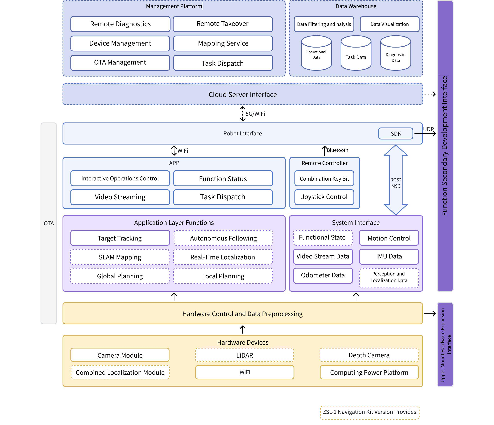
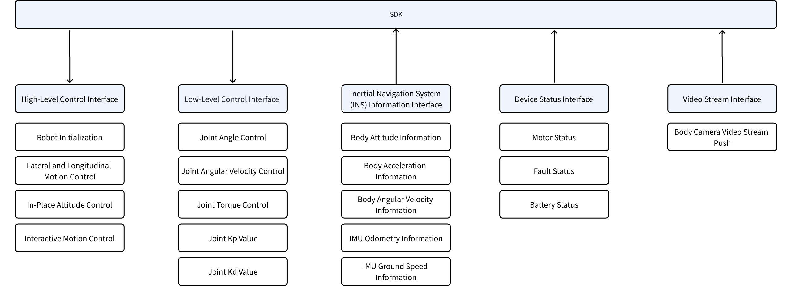
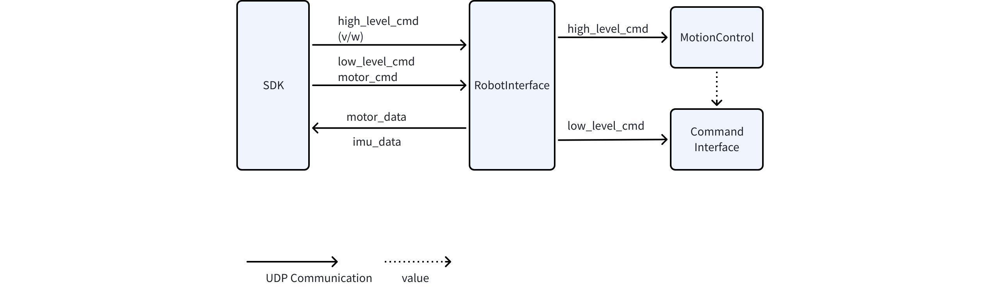
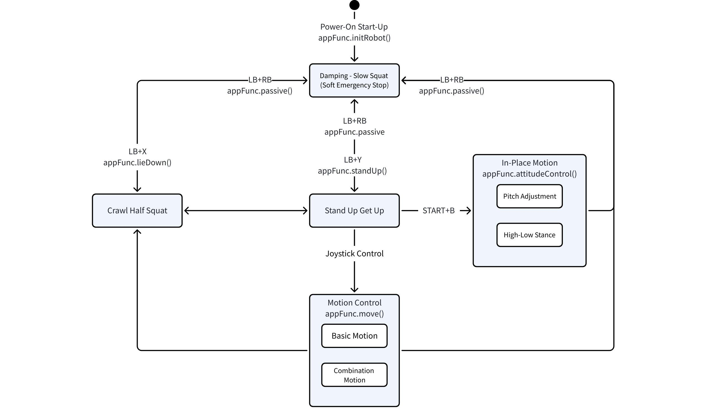
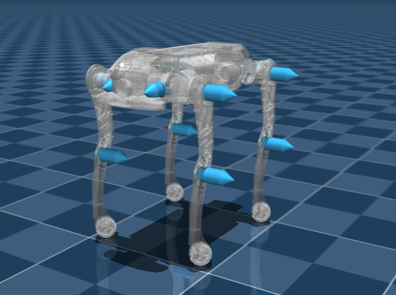

# Architecture and Directory Structure

> This section describes only the directory structure and module relationships of the **released version**, and does not involve the internal implementation in `/src`.

## Top-level Directory Structure (Summary)

```
├─ demo/
│  ├─ zsl-1/
│  │  ├─ cpp/
│  │  └─ python/
│  └─ zsl-1w/
│     ├─ cpp/
│     └─ python/
├─ include/
│  ├─ zsl-1/
│  │  ├─ highlevel.h
│  │  └─ lowlevel.h
│  ├─ zsl-1w/
│  │  └─ highlevel.h
│  ├─ lowlevel/
│  │  └─ lowlevel.h
├─ lib/
│  ├─ zsl-1/
│  │  ├─ aarch64/
│  │  └─ x86_64/
│  ├─ zsl-1w/
│  │  ├─ aarch64/
│  │  └─ x86_64/

```

Key directory descriptions:

- `include/`: Header files (public headers and model-specific headers)
    - `include/zsl-1/highlevel.h`, `include/zsl-1/lowlevel.h`
    - `include/zsl-1w/highlevel.h`
    <!-- - `include/zsm-1w/highlevel.h` -->

- `lib/`: Compiled runtime libraries (separated by model and architecture)
    - `lib/<model>/<arch>/libmc_sdk_<model>_<arch>.so`
    - `lib/<model>/<arch>/mc_sdk_<model>_py.*.so` (Python extension)

- `demo/`: Sample programs (C++ / Python)
    - `demo/zsl-1/cpp`, `demo/zsl-1/python/examples`
    - `demo/zsl-1w/cpp`, `demo/zsl-1w/python/examples`
    <!-- - **Note**: The current repository does not provide `zsm-1w` demos, refer to `zsl-1w` examples for migration -->
- Other: `CMakeLists.txt`, `build.sh`, `README.md`, etc.

## ZsiBot System Architecture




## SDK Software Block Diagram
> Currently, motion control-related SDK interfaces are open, including high-level motion control interfaces, low-level motor control interfaces, IMU inertial data interfaces, and motor status data interfaces



## SDK Software Interfaces




## Motion Control State Machine

Instructions need to be issued according to the following state transition logic, otherwise the machine may fall, malfunction, or not respond



## Joint Control Command Description

**📌 Command Order**

- FR (right front)
- FL (left front)
- RR (right rear)
- RL (left rear)

### 🔄 Joint Direction Definition

- A, H, K Joint Coordinate System: Forward as X-axis, Left as Y-axis, Up as Z-axis
- Leg Order: Front-Right, Front-Left, Rear-Right, Rear-Left
- Rotational Coordinate System: Right-Hand Rule
- Forward Direction: Positive X-axis; Left Direction: Positive Y-axis; Up Direction: Positive Z-axis


### 🔧 Control Parameters

```c++
Joint angle commands
float q_des_abad[4] // A joint angle command
float q_des_hip[4]  // H joint angle command
float q_des_knee[4] // K joint angle command

Joint angular velocity commands
float qd_des_abad[4]  // A joint angular velocity command
float qd_des_hip[4]  // H joint angular velocity command
float qd_des_knee[4] // K joint angular velocity command

Joint PID parameters
float kp_abad[4]  // A joint Kp
float kp_hip[4]   // H joint Kp
float kp_knee[4] // K joint Kp

float kd_abad[4]  // A joint Kd
float kd_hip[4]   // H joint Kd
float kd_knee[4]  // K joint Kd

Joint torque commands
float tau_abad_ff[4]  // A joint torque command
float tau_hip_ff[4]   // H joint torque command
float tau_knee_ff[4]  // K joint torque command
```
