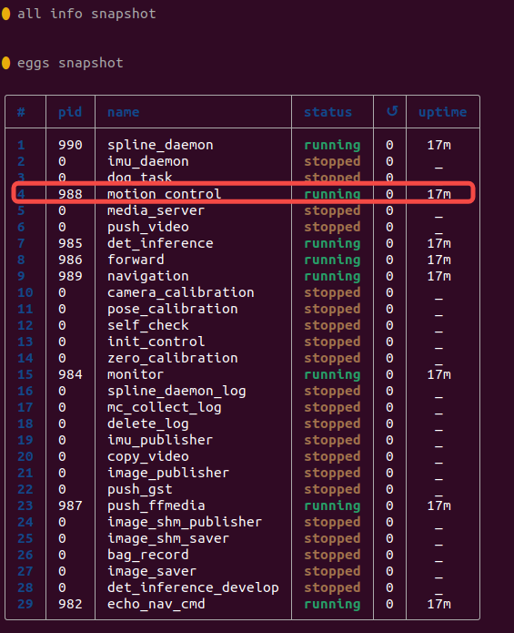

# How to Debug

---

## 异常处理
### 开机后运控启动时网络端口未初始化
部分情况下会存在运控程序启动时，系统网络未初始化完成，此时使用SDK调用运动控制时会存在无法正常使用。
若存在上述现象，可通过登录设备主控后，执行命令`sudo lsof -i -P -n -c mc_ctrl|grep 43997`查看输出内容中是否有对应端口被绑定。
若端口无正常绑定，可执行`robot-launch list`查看程序列表，并选择对应`motion control`的程序前方对应的编号，如下图所示执行`robot-launch restart 4`进行重启运控程序，再使用SDK时是否恢复正常。


若恢复正常，可在运控启动脚本中增加休眠，等待网络初始化完成后再启动运控即可，具体操作方法如下：
按当前文档操作步骤所示，编辑文件`/opt/app_launch/start_motion_control.sh`并在最后一行脚本上方增加`sleep 10`即可。
此现象仅在设备断电重启后会存在

### 使用wlan0连接环境wifi方式控制，SDK无法通讯
在设备开机时，若wlan0网卡无法及时连接到环境wifi，会导致运控程序绑定IP时失败，此时再运行SDK会导致通讯超时，此时需要按上方文档操作步骤所示，编辑文件`/opt/app_launch/start_motion_control.sh`并在最后一行脚本上方增加`sleep 10`即可。

### 使用wlan0连接环境wifi，每次重启设备都不会自动连接
设备上AP与wlan网卡存在冲突，部分版本有清除自动连接功能，若需要关闭清除自动连接功能，可执行以下命令：
```bash
sudo systemctl stop networkmanager-cleanup.service
sudo systemctl disable networkmanager-cleanup.service
```

## FAQ
1. Q1:运控中获取设备状态接口支持频率?
    - lowlevel 的500hz, highlevel的50hz
2. Q2: 运控中请求接口支持频率?
    - 请求数据需要以500hz发送才能保证设备稳定运行